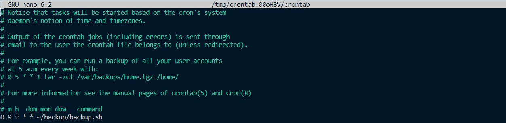

# PacToDo Deployment Using Docker

## Background
To ensure that the app can run seamlessly on various servers, i utilized Docker for deployment. Docker provides an isolated environment for the app, enhancing portability and security.

## Building Container Using Docker Compose
Before creating containers, I created a Docker image for building the React and Flask images. The Flask image utilized Python 3.10 as its base image, while the React image was built using multi-stage builds with node and nginx as base images. 

### Flask Dockerfile
```
FROM python:3.10
COPY . /app
WORKDIR /app
RUN pip install -r requirement.txt
EXPOSE 5000
CMD ["python","run.py"]
```
### React Dockerfile
```
FROM node:14 as build
WORKDIR /app
ENV PATH /app/node_modules/.bin:$PATH
COPY package*.json ./
RUN npm install
COPY . .
RUN npm run build


FROM nginx:alpine
COPY --from=build /app/dist /usr/share/nginx/html
COPY ./nginx.default.conf /etc/nginx/conf.d/default.conf
EXPOSE 80
CMD ["nginx", "-g", "daemon off;"]
```
The `nginx.default.conf` file contains proxy configuration used to make API calls to the Flask container.
#### nginx.default.conf
```
server {
    listen       80;
    server_name  localhost;

    root   /usr/share/nginx/html;
    index index.html;
    error_page   500 502 503 504  /50x.html;

    location / {
        try_files $uri $uri/ =404;
        add_header Cache-Control "no-cache";
    }

    location /static {
        expires 1y;
        add_header Cache-Control "public";
    }

    location /api {
        proxy_pass http://flaskapp:5000; # using flask service as proxy pass
    }
}
```
### Docker Compose Configuration
The Flask, React, and PostgreSQL containers are built using Docker Compose with the following configurations.
```
version: '3'
services:
    flaskapp:
      build:
        context: ./flask
        dockerfile: Dockerfile
      container_name: todo_flask
      environment:
      - SQLALCHEMY_DATABASE_URI=${SQLALCHEMY_DATABASE_URI}
      - JWT_SECRET_KEY=${JWT_SECRET_KEY}
      ports:
        - 5000:5000
      depends_on: 
        - postgres
      networks:
        - mynetworks
    
    reactapp:
      build: 
        context: ./react
        dockerfile: Dockerfile
      container_name: todo_react
      ports:
        - 80:80
      depends_on:
        - flaskapp
      networks:
        - mynetworks

    postgres:
      image: postgres:latest
      container_name: todo_postgres
      ports:
        - 5439:5432
      environment:
      - POSTGRES_USER=${POSTGRES_USER}
      - POSTGRES_PASSWORD=${POSTGRES_PASSWORD}
      - POSTGRES_DB=${POSTGRES_DB}
      volumes:
        - postgres-volume:/var/lib/postgresql/data
        - ./postgres/init.sql:/docker-entrypoint-initdb.d/init.sql
      networks: 
        - mynetworks

networks:
  mynetworks:
volumes:
  postgres-volume:
```
Environment variables are imported from a .env file for security reasons.
## Back Up Database and Scheduling Using Cron
We can back up the database by running the `backup.sh` script in the Linux terminal.
```
#!/bin/bash

source $(realpath ~/backup/config.txt)

current_datetime=$(date +"%y%m%d_%H%M%S")

container_name="todo_postgres"

backup_dir="$(realpath ~/backup/todo_postgres)"

db_user=$POSTGRES_USER

backup_file="$backup_dir/backup_$current_datetime.sql"


docker exec -i $container_name pg_dumpall -U $db_user > $backup_file

if [ $? -eq 0 ]; then
    echo "Database backup successful. Backup saved as $backup_file"
else
    echo "Database backup failed."
fi
```
The `config.txt` file contains the values of the `POSTGRES_USER` variable. I sourced it into the script so that the variables are only available while the script is running.  
To enable automatic backups, I have configured a cron service schedule to back up the database daily at 9 AM.
  
If the backup process is successs, the backup files are saved as SQL file in the `backup_dir`. You can check example of the backup files in [this folder](/backup-database)
## Restore Database
We can use backup file to restore database by running `restore.sh` in the Linux terminal.
```
#!/bin/bash

source $(realpath ~/backup/config.txt)

db_name=$POSTGRES_DB

db_user=$POSTGRES_USER

CONTAINER_NAME="todo_postgres"

read -p "Enter the path to the backup file: " BACKUP_FILE

if [ ! -f "$BACKUP_FILE" ]; then
    echo "Backup file does not exist."
    exit 1
fi

docker cp $BACKUP_FILE $CONTAINER_NAME:/backup-file.sql

docker exec -it $CONTAINER_NAME bash -c "psql -U $db_user -d $db_name -f /backup-file.sql"

if [ $? -eq 0 ]; then
    echo "Backup restore completed successfully."
else
    echo "Backup restore failed."
fi
```
The `config.txt` file contains the values of the `POSTGRES_USER` and `POSTGRES_DB` variables. I sourced it into the script so that the variables are only available while the script is running.  
We can input the path of the backup file we want to use to restore the database. If the file is available, it will be copied to the PostgreSQL container, and the psql restore command will be executed.
## Complete Code and Documentation
You can find the complete code of the application in [this repository.](https://github.com/naputami/Fullstack-TodoApp)